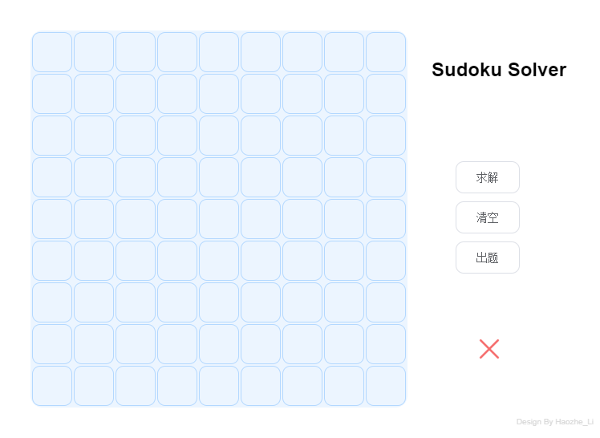
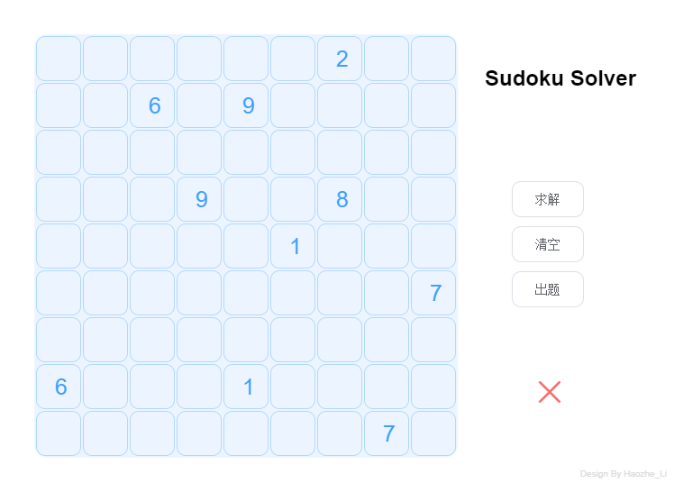
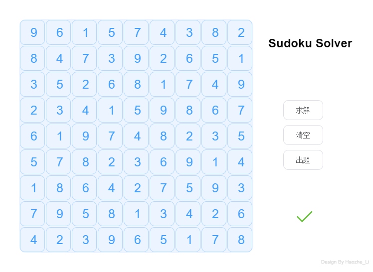

# 数独——Sudoku Solver

> 李浩哲 1712898

## 部署说明

本项目基于`Node.js`的`Vue.js`及`Electron`编写，使用`Vue.js`组件完成页面功能实现，使用`Electron`生成桌面端应用。
[GitHub链接](https://github.com/Azerrroth/Sudoku)

### 运行环境
``` java
- Node.js 10.16.0
- Electron 7.2.4
- Vue.js 2.5.16
- Element-UI 2.12.0
```
### 运行方法

``` bash
# install dependencies
npm install

# serve with hot reload at localhost:9080
npm run dev

# build electron application for production
npm run build
```

---

## 实验目的

使用搜索算法，解决数独求解问题。即根据给定数独排列，使用数字 1-9 补全九宫格中的数字，且每一行、每一列、每一宫中的数字都不出现重复的数字。

## 算法说明

解决数独求解问题，如果简单遍历求解，那么遍历次数非常庞大，最差的情况需要
$ 9^{81} $次遍历，所以采用启发式搜索方法，降低解决问题的成本，同时也极大地提高了解决问题的效率。

#### 概述

对于数独问题，可以采用回溯的搜索方式，同时分析人脑解决数独问题的方式，根据人脑解决数独问题的思路，采用类似的启发式搜索方案，逐渐逼近目标结果。

#### 算法思路
1. 首先找出数独中所有空格，并计算每个空格中所有可填入的数字列表`Num`。
2. 筛选，找出`Num.length`最小的空格，数量为$N_{xy}$。
3. 如果$N_{xy} = 0$，则寻找上一个填入的空格，并且上一个空格的其他侯选数字
4. 如果如果$N_{xy} \neq 0$，则填入该格子可填入的其他侯选数字。
5. 重复(3)(4)步骤，直到数独中空格数为 0，即数独问题解决。

详细流程如图：

#### 寻找数独棋盘中的空格
寻找数独中的空格，记录数量，并将其位置座标加入posList中，返回当前数独中空格数量、及其位置列表。
``` js
  FindZero () {
    let count = 0
    let posList = []
    for (let i = 0; i < 9; i++) {
      for (let j = 0; j < 9; j++) {
        if (this.numbers[i][j] === 0) {
          let posXY = [i, j]
          posList.push(posXY)
          count++
        }
      }
    }
    return [count, posList] 
  }
```

#### 计算侯选数字列表
输入数独的空格，计算该空格侯选数字的列表及数目，返回侯选数字列表、位置列表、空格数目。
``` js
  ComputeCandidate (zero) {
    let CandidateList = []
    let count = zero[0]
    let posList = zero[1]
    for (let i = 0; i < count; i++) {
      let Num = [1, 2, 3, 4, 5, 6, 7, 8, 9]
      let x = posList[i][0]
      let y = posList[i][1]
      let x0 = Math.floor(x / 3)
      let y0 = Math.floor(y / 3)
      for (let j = 0; j < 9; j++) {
        if (Num.indexOf(this.numbers[x][j]) !== -1) {
          Num.splice(Num.indexOf(this.numbers[x][j]), 1)
        }
      }
      for (let k = 0; k < 9; k++) {
        if (Num.indexOf(this.numbers[k][y]) !== -1) {
          Num.splice(Num.indexOf(this.numbers[k][y]), 1)
        }
      }
      for (let m = 0; m < 3; m++) {
        for (let n = 0; n < 3; n++) {
          if (Num.indexOf(this.numbers[x0 * 3 + m][y0 * 3 + n]) !== -1) {
            Num.splice(Num.indexOf(this.numbers[x0 * 3 + m][y0 * 3 + n]), 1)
          }
        }
      }
      CandidateList.push(Num)
    }
    return [CandidateList, posList, count]
  }
```

#### 寻找侯选数字数目最小的空格
输入侯选数字列表及其座标信息，返回侯选数字最少的空格，及该空格位置座标。
``` js
  FindMin (maps) {
    let NumOfCandidate = []
    let CandidateList = maps[0]
    let posList = maps[1]
    let count = maps[2]
    for (let i = 0; i < count; i++) {
      let temp = CandidateList[i].length
      NumOfCandidate.push(temp)
    }
    let Min = Math.min.apply(null, NumOfCandidate)
    let MinIndex = NumOfCandidate.indexOf(Min)
    return [Min, MinIndex, posList[MinIndex]]
  }
```

#### 解决数独问题
解决数独问题，其中this.numbers为数独方格填入的数字。
最后返回的 TotalTimes 为解决该数独进行的搜索迭代次数。
``` js
  async Solve () {
    let temp = this.FindZero()
    let posList = temp[1]
    let count = temp[0]
    let TotalTimes = 0
    // 侯选列表
    let PopCandidateList = []
    let PopPosList = []
    this.Processing = true
    while (count) {
      let CandidateList = this.ComputeCandidate([count, posList])[0]
      temp = this.FindMin([CandidateList, posList, count])
      let Min = temp[0]
      let MinIndex = temp[1]
      let MinPos = temp[2]
      // 出现有为 0 （未填入数字）的点，且该点没有可以取的值
      if (Min === 0) {
        // 回退N步，直到上一个加入Pop Candidate List中的点不只有一种取值可能
        while (PopCandidateList[PopCandidateList.length - 1].length === 0) {
          let x = PopPosList[PopPosList.length - 1][0]
          let y = PopPosList[PopPosList.length - 1][1]
          this.numbers[x][y] = 0
          this.$forceUpdate()
          if (this.delayTime > 0) {
            await this.sleep(this.delayTime)
          }
          // 将上一次迭代填入空格的数去除（设为0）
          count += 1
          posList.push(PopPosList[PopPosList.length - 1])
          PopPosList.splice(-1, 1)
          PopCandidateList.splice(-1, 1)
        }
        let x = PopPosList[PopPosList.length - 1][0]
        let y = PopPosList[PopPosList.length - 1][1]
        this.numbers[x][y] = PopCandidateList[PopCandidateList.length - 1][0] // 赋前一个侯选位置的可选值 0
        this.$forceUpdate()
        if (this.delayTime > 0) {
          await this.sleep(this.delayTime)
        }
        PopCandidateList[PopCandidateList.length - 1].splice(0, 1)
        TotalTimes = TotalTimes + 1
      } else {
        let x = MinPos[0]
        let y = MinPos[1]
        this.numbers[x][y] = CandidateList[MinIndex][0] // 取出Min Candidate 所有可取值的第一个值
        this.$forceUpdate()
        if (this.delayTime > 0) {
          await this.sleep(this.delayTime)
        }
        let PopCandidate = CandidateList[MinIndex]
        CandidateList.splice(MinIndex, 1)
        PopCandidate.splice(0, 1)
        PopCandidateList.push(PopCandidate) // 将取出的可选数字最小的Candidate 放入Pop Candidate List中
        let PopPos = posList[MinIndex]
        posList.splice(MinIndex, 1)
        PopPosList.push(PopPos) // 将取出可选数字最小对应的点放入Pop Pos List 中
        count--
        TotalTimes++
      }
    }
    console.log(TotalTimes)
    this.correct = this.Check()
    this.Processing = false
    return TotalTimes
  }
```

## 测试方式
目录中附带已经打包生成的可执行文件`sudoku Setup 1.1.0.exe`（注：当前版本为演示搜索过程，故对每次搜索都增加了`100ms`延时，以清晰展现搜索的过程，），Windows环境下双击执行文件，打开后进入 
#### 使用`sudoku Setup 1.1.0.exe`测试
目录中附带已经Build生成的可执行文件，Windows环境下双击安装完成后即可打开，进入程序主界面。
##### 1. 输入自选的数独题目
  点击空格，敲击键盘`1-9`输入数字，`Esc`删除空格中的数字。输入完成后点击`求解`按钮，即可搜索解题。当格中数字满足数独成立条件时，右侧红叉变为绿色对勾，证明解题完成。
##### 2. 随机出题，并且解决
  点击右侧`出题`按钮，会随机生成可解数独，然后点击`求解`按钮，即可获得数独答案。

#### 使用源代码编译测试
1. 获取本项目完整项目内容
``` bash
git clone https://github.com/Azerrroth/Sudoku.git
```
2. 安装所需模块
``` bash
npm install
```
3. 运行
``` bash
npm run dev
```

- 注：在`Sudoku/src/renderer/components/MainPage.vue`中，可以调节`data ()`中的`delayTime`参数，来调节搜索过程中每次操作延迟的时间，单位`ms`
``` js
  data () {
    return {
      numbers: [[]],
      correct: false,
      Processing: false,
      delayTime: 100
    }
  }
```

## 实验结果展示
#### 程序主界面


#### 随机出题


#### 解题

